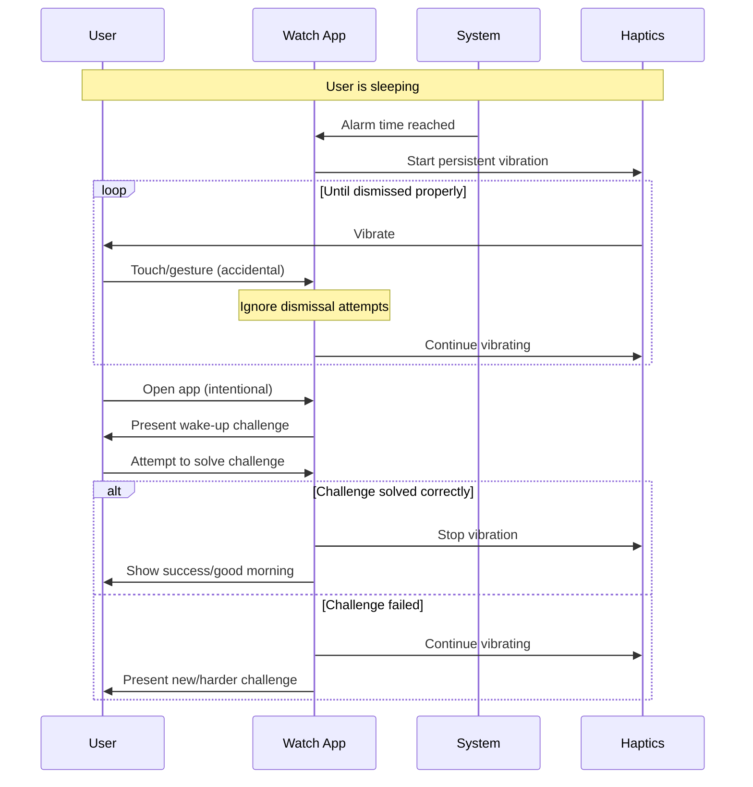
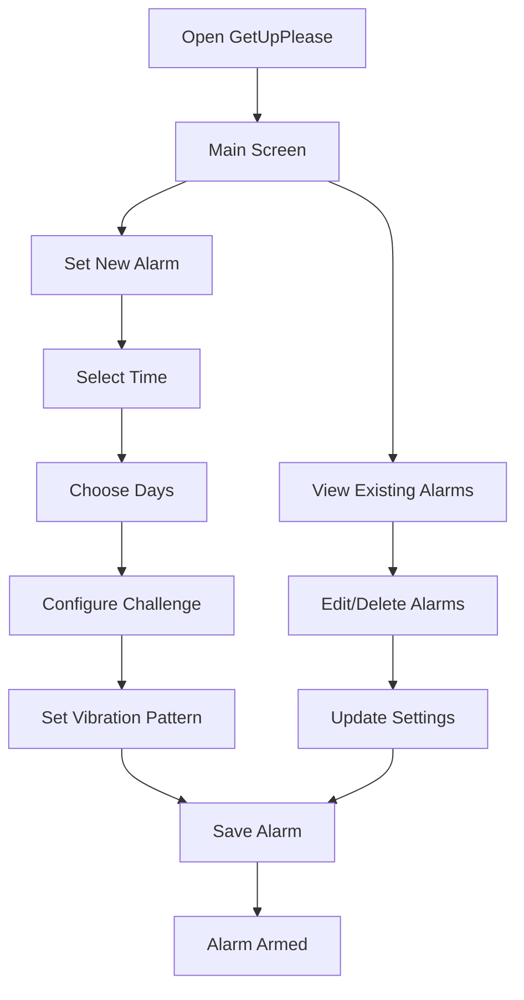

# GetUpPlease - Requirements Document

## Project Overview
**GetUpPlease** is a custom Apple Watch alarm application designed to solve the problem of accidental alarm dismissal during sleep, ensuring the user is fully awake before stopping.

---

## User Story & Problem Statement

### Primary User
- Sleeps with Apple Watch on
- Uses watch as primary alarm (vibration only, no sound)
- Shares sleeping space (needs silent wake-up)
- Experiences issue with built-in alarm stopping when watch is covered

### Core Problem
The built-in Apple Watch alarm stops vibrating when the watch face is covered or touched, leading to accidental dismissal before the user is fully awake.

**Technical Root Cause**: Apple Watch's "Cover to Mute" feature automatically mutes notifications and sounds when the watch face is covered with palm for 3+ seconds. This system behavior, while useful for normal notifications, causes alarm failures during sleep when users accidentally cover the watch face.

### Solution Goal
Create a persistent alarm system that requires cognitive engagement to dismiss, ensuring the user is mentally alert before the alarm stops.

**Technical Solution**: Bypass Apple's system notification behavior by implementing custom UI and direct haptic control that ignores "Cover to Mute" functionality and other system-level dismissal mechanisms.

---

## Core Requirements

### 1. Persistent Alarm System
- **Requirement**: Alarm continues vibrating regardless of watch coverage, gestures, or accidental touches
- **Priority**: Critical
- **Technical Note**: Override default watchOS alarm dismissal behaviors

### 2. Cognitive Wake-up Challenge
- **Requirement**: User must solve questions/puzzles to dismiss alarm
- **Priority**: Critical  
- **Purpose**: Ensure mental alertness before alarm stops

### 3. Silent Operation
- **Requirement**: Vibration-only alarm system
- **Priority**: Critical
- **Constraint**: No audio to avoid disturbing sleeping partner

### 4. Sleep-aware Scheduling
- **Requirement**: Set and manage alarm times
- **Priority**: High
- **Details**: Support for multiple alarms, different days, recurring schedules

---

## User Flow Diagrams

### Main Alarm Flow

### Alarm Setup Flow

---

## Detailed Feature Requirements

### Alarm Management
- [ ] **Create multiple alarms** with individual settings
- [ ] **Recurring schedules** (daily, weekdays, weekends, custom days)
- [ ] **One-time alarms** for special occasions
- [ ] **Alarm preview** - test vibration and challenge before saving
- [ ] **Quick enable/disable** toggle for each alarm

### Wake-up Challenge System
- [ ] **Multiple challenge types** (to be defined)
- [ ] **Difficulty scaling** based on user performance
- [ ] **Challenge randomization** to prevent memorization
- [ ] **Failure handling** - continue alarm if challenge failed
- [ ] **Maximum attempts** before escalation

### Vibration System
- [ ] **Persistent vibration** - ignore accidental touches/coverage
- [ ] **Pattern customization** - different intensities/rhythms
- [ ] **Escalation** - increase intensity over time
- [ ] **Battery optimization** - efficient haptic usage
- [ ] **Maximum duration** - safety timeout

### User Interface
- [ ] **Sleep-friendly design** - dark mode, large buttons
- [ ] **Quick actions** - minimal taps needed when drowsy
- [ ] **Challenge UI** - clear, large elements for sleepy interaction
- [ ] **Status indicators** - alarm armed/active states
- [ ] **Settings panel** - customize all behaviors

---

## Open Questions & Decisions Needed

### Alarm Triggering Strategy
- **MVP Decision**: Fixed time alarms (traditional alarm functionality)
- **Advanced Options for Future**: 
  - Sleep cycle integration (requires HealthKit)
  - Smart wake-up windows
  - Context-aware triggering
- **Status**: ✅ MVP defined, advanced features identified

### Wake-up Challenge Types
- **MVP Decision**: Simple math problems (addition, subtraction with two random digits)
- **MVP Rules**: 
  - 5 consecutive correct answers required to dismiss
  - 10 consecutive failures = automatic dismiss (emergency escape)
  - Tap-based input with number display (like passcode entry)
  - "Wrong, try again" feedback only
- **Advanced Options for Future**: Other challenge types (pattern matching, memory, etc.)
- **Status**: ✅ MVP fully defined and locked

### Vibration Behavior
- **MVP Decision**: Basic escalation - gradually increasing intensity over time
- **MVP Pattern**: 
  - Start: Gentle vibration (2-3 taps every 10 seconds)
  - After 1 minute: Medium vibration (longer pulses every 8 seconds)
  - After 2 minutes: Strong vibration (continuous pattern every 5 seconds)
  - Maintain: Strong pattern until dismissed or failed
- **Advanced Options for Future**: Custom patterns, smart escalation, battery optimization
- **Status**: ✅ MVP defined

### Safety & Backup Systems
- **Question**: What happens if user doesn't respond to alarm?
- **Options**:
  - Maximum duration then give up
  - Escalate to sound after X minutes
  - Send emergency notification to contacts
  - Continue indefinitely with battery warning
- **Status**: 🔄 Pending decision

### Data & Privacy
- **Question**: What data should be stored and where?
- **Considerations**:
  - Alarm history and performance
  - Sleep patterns (if integrated)
  - Challenge success rates
  - Local vs. cloud storage
- **Status**: 🔄 Pending decision

---

## Technical Considerations

### Apple Watch Development Areas
- **Background Tasks**: Alarm scheduling and triggering
- **Haptic Feedback**: Custom vibration patterns
- **App Lifecycle**: Handling wake from background
- **User Interface**: Watch-optimized challenge screens
- **Local Notifications**: Alarm scheduling
- **Core Data**: Alarm and settings storage
- **HealthKit**: Potential sleep data integration

### Development Phases
1. **Phase 1 (MVP)**: Fixed-time alarms with basic challenge
2. **Phase 2**: Advanced challenges and customization  
3. **Phase 3**: Smart alarm triggering features
4. **Phase 4**: Health integration and analytics

## MVP Definition

### Core MVP Features (Phase 1)
- [x] **Fixed-time alarm creation** - Set specific hour:minute
- [x] **Multiple alarms** - Create, edit, delete multiple alarms
- [x] **Basic scheduling** - One-time or daily repeat
- [x] **Simple on/off toggle** - Enable/disable each alarm
- [x] **Basic alarm triggering** - Fire at exact scheduled time
- [x] **Escalating vibration system** - Gentle → Medium → Strong over 2 minutes
- [x] **Vibration persistence** - Continue until challenge completed or 10 failures
- [x] **Math challenge system** - Addition/subtraction with two random digits
- [x] **Challenge requirement** - 5 consecutive correct answers to dismiss
- [x] **Input method** - Tap number buttons (like passcode screen) with display
- [x] **Wrong answer handling** - Show "Wrong, try again", present new problem
- [x] **Emergency escape** - Dismiss alarm after 10 consecutive failures

### Advanced Alarm Triggering Features (Future Phases)

#### 1. Smart Wake-up Windows (Phase 3)
**Concept**: Instead of waking at exact time, wake during lighter sleep phase within a window
- **Implementation**: Set target time ± 15-30 minutes
- **Technology**: HealthKit sleep analysis or motion detection
- **Benefit**: Wake during natural sleep cycle break
- **Example**: "Wake me between 7:00-7:30 AM when I'm in light sleep"

#### 2. Sleep Cycle Integration (Phase 3)
**Concept**: Analyze sleep patterns to optimize wake times
- **Data Sources**: Apple Health, motion sensors, heart rate
- **Features**: 
  - Detect REM/deep sleep phases
  - Recommend optimal bedtimes
  - Track sleep quality vs. wake-up difficulty
- **Smart Logic**: "Don't wake during deep sleep unless critical"

#### 3. Context-Aware Triggering (Phase 4)
**Concept**: Adapt alarm behavior based on context
- **Calendar Integration**: Earlier wake-up for important meetings
- **Weather Integration**: Extra time for bad weather commutes
- **Location Awareness**: Different alarms for home vs. travel
- **Activity Recognition**: Skip workout alarms if already active

#### 4. Adaptive Timing (Phase 4)
**Concept**: Learn user patterns and adjust automatically
- **Learning**: Track how long user takes to get ready
- **Adaptation**: Gradually adjust wake time based on user behavior
- **Feedback Loop**: "You've been hitting snooze a lot, should we move this earlier?"

#### 5. Progressive Wake-up (Phase 3)
**Concept**: Gradually increase stimulation before main alarm
- **Pre-alarm**: Gentle vibration 10-15 minutes before
- **Light simulation**: Brighten watch screen gradually (if supported)
- **Escalation**: Soft → medium → strong vibration patterns

### Advanced Wake-up Challenge Features (Future Phases)

#### 1. Dynamic Difficulty Scaling (Phase 2)
**Concept**: Adjust problem difficulty based on user performance and time of day
- **Easy Mode**: Single digit addition (3+5, 7+2)
- **Medium Mode**: Double digit addition (15+23, 34+17)
- **Hard Mode**: Mixed operations with larger numbers (47-18, 23+35)
- **Adaptive**: Start easy, increase if user solving too quickly
- **Time-based**: Harder problems = more awake you should be

#### 2. Challenge Variety (Phase 2)
**Concept**: Multiple types of cognitive challenges to prevent habituation
- **Math Variations**: Multiplication, division, percentage calculations
- **Pattern Recognition**: Complete sequences (2,4,6,8,?)
- **Memory Games**: Remember and repeat number/color sequences
- **Logic Puzzles**: Simple "if-then" statements
- **Word Games**: Unscramble words, simple vocabulary
- **Mixed Mode**: Random selection to keep brain engaged

#### 3. Progressive Challenge System (Phase 2)
**Concept**: Build up cognitive load gradually
- **Stage 1**: 3 simple addition problems (warm-up)
- **Stage 2**: 2 subtraction problems (increase difficulty)
- **Stage 3**: 1 mixed operation problem (final challenge)
- **Failure Reset**: Wrong answer resets to previous stage
- **Success Tracking**: Track performance over time

#### 4. Personalization & Learning (Phase 3)
**Concept**: Adapt to individual cognitive patterns
- **Weak Areas**: Focus on operations user struggles with
- **Time Adaptation**: Different difficulties for different wake times
- **Performance Tracking**: Analyze response time and accuracy
- **Custom Ranges**: User-defined number ranges for problems
- **Learning Mode**: Introduce new challenge types gradually

#### 5. Accessibility & Customization (Phase 2)
**Concept**: Make challenges work for different users and situations
- **Large Text Mode**: Extra big numbers for sleepy eyes
- **Voice Input**: Speak answers instead of typing (if needed)
- **Color Coding**: Visual cues for operations (+/-/×/÷)
- **Custom Count**: Change from 5 to user preference (3-10)
- **Emergency Skip**: After X failures, allow simpler override
- **Challenge Preview**: Test difficulty during alarm setup

---

## Success Criteria
- User wakes up fully alert (no accidental dismissal)
- Minimal battery impact during sleep
- Reliable alarm triggering
- Intuitive interface even when drowsy
- Wife's sleep remains undisturbed

---

## Document Status
- **Created**: [Date]
- **Last Updated**: [Date]
- **Next Review**: When next requirement discussion occurs
- **Status**: 🔄 Requirements gathering in progress

*This document will be updated as requirements are refined and decisions are made.*